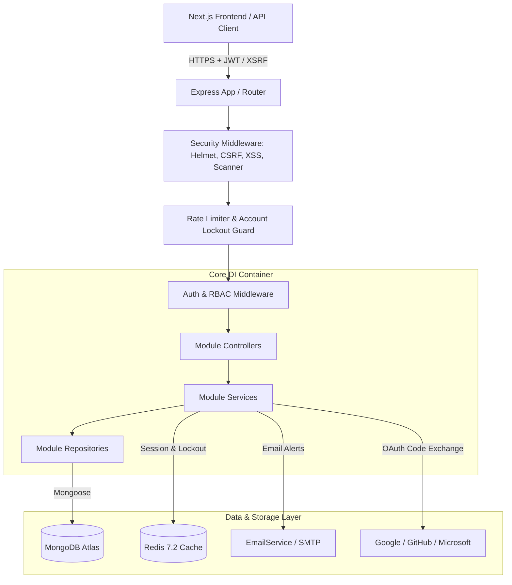
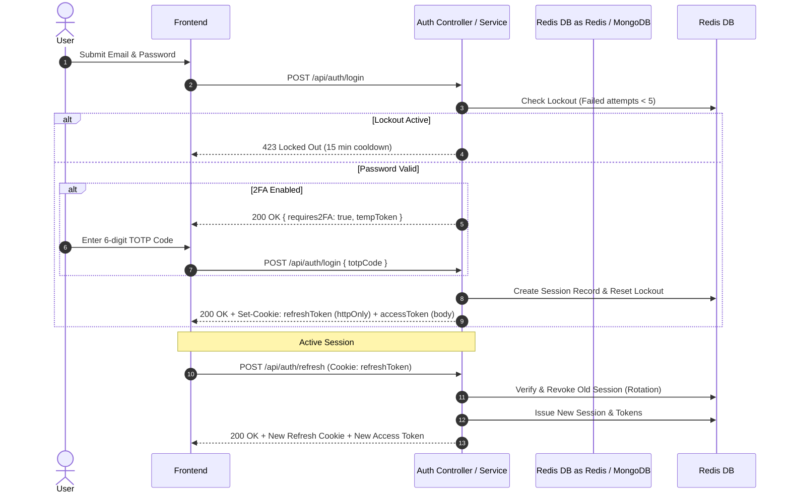
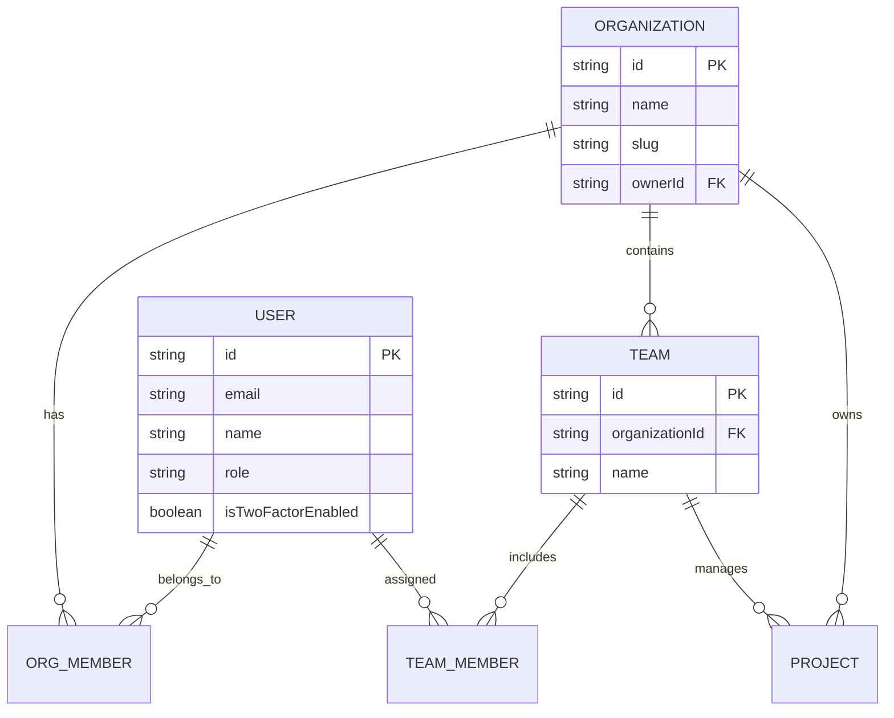

# StoryForge AI V3 — Phase 1: Enterprise Identity, Security & User Management Documentation

## 📚 Executive Overview

Phase 1 establishes a production-grade, enterprise Identity, Security, Permissions, and Multi-Tenant User Management infrastructure for **StoryForge AI V3**. The architecture is engineered to support millions of concurrent users with zero single points of failure, multi-device session tracking, granular Role-Based Access Control (RBAC), and strict OWASP Top 10 security compliance.

---

## 🏗️ System Architecture & Layering

The backend has been refactored into clean **Feature Modules**, adhering strictly to the **Repository Pattern** and injected via a custom, lightweight **Dependency Injection Container** (`src/core/container.ts`).



---

## 🔑 Authentication & Token Lifecycle

### 1. Token Architecture
- **Access Tokens**: Short-lived (15 minutes) JSON Web Tokens (JWT) signed with HMAC-SHA256 (`JWT_SECRET`). Contains `userId`, `role`, and unique token identifier `jti`.
- **Refresh Tokens**: Long-lived (30 days) cryptographically random JWTs issued alongside a unique `tokenId`.
- **Refresh Token Rotation (RTR)**: Every time a refresh token is presented to `/api/auth/refresh`, the old session is immediately revoked and a brand new token pair is issued.

### 2. Session Lifecycle Diagram



---

## 🛡️ Security Engine & OWASP Defenses

| Security Layer | Implementation Mechanism | Enforcement |
|----------------|--------------------------|-------------|
| **CSRF Defense** | Double-Submit Cookie Pattern (`XSRF-TOKEN`) | `csrfProtection` middleware checks `X-XSRF-TOKEN` header on non-safe HTTP methods (`POST`, `PUT`, `PATCH`, `DELETE`). |
| **XSS & NoSQL Injection** | Recursive Tree Sanitizer | `sanitizeInput` strips `<script>` tags, inline JS handlers, and excludes keys starting with `$` to prevent Mongo operator injection. |
| **Account Lockout** | Failed Attempt Counter | Locks account for 15 minutes after 5 consecutive failed login attempts (`MAX_FAILED_LOGIN_ATTEMPTS`). |
| **Scanner / Bot Guard** | User-Agent Inspection | `suspiciousLoginDetector` flags and blocks known security scanners (`sqlmap`, `nikto`, `nmap`). |
| **Password Hashing** | Bcrypt (Cost factor 12) | Password hashes include salt rounds; original plain text is never stored or logged. |
| **HTTP Security Headers** | Helmet Middleware | Strict Transport Security (HSTS), Content Security Policy (CSP), X-Frame-Options (`DENY`), X-Content-Type-Options (`nosniff`). |

---

## 🏢 Multi-Tenant Organizations, Teams & RBAC

StoryForge AI supports hierarchical multi-tenancy. A **User** can own or belong to multiple **Organizations**, which contain **Teams** and **Projects**.



### RBAC Permission Matrix

| Permission Key | Org Owner | Org Admin | Org Member | Org Guest | Team Editor | Team Viewer |
|----------------|:---------:|:---------:|:----------:|:---------:|:-----------:|:-----------:|
| `project:create` | ✅ | ✅ | ✅ | ❌ | ✅ | ❌ |
| `project:read` | ✅ | ✅ | ✅ | ✅ | ✅ | ✅ |
| `project:update` | ✅ | ✅ | ✅ | ❌ | ✅ | ❌ |
| `project:delete` | ✅ | ✅ | ❌ | ❌ | ❌ | ❌ |
| `ai:generate` | ✅ | ✅ | ✅ | ❌ | ✅ | ❌ |
| `billing:manage` | ✅ | ❌ | ❌ | ❌ | ❌ | ❌ |
| `org:invite` | ✅ | ✅ | ❌ | ❌ | ❌ | ❌ |
| `org:manage` | ✅ | ❌ | ❌ | ❌ | ❌ | ❌ |
| `team:create` | ✅ | ✅ | ❌ | ❌ | ❌ | ❌ |
| `team:manage` | ✅ | ✅ | ❌ | ❌ | ❌ | ❌ |
| `video:publish` | ✅ | ✅ | ✅ | ❌ | ✅ | ❌ |
| `analytics:view` | ✅ | ✅ | ✅ | ✅ | ✅ | ✅ |

---

## 📱 Two-Factor Authentication (2FA/TOTP) & OAuth

### 1. TOTP 2FA Setup
1. User requests 2FA setup via `POST /api/users/2fa/setup`.
2. Backend generates a 160-bit cryptographically secure secret and renders a standard `otpauth://` QR code data URL.
3. User scans with Google Authenticator or 1Password and submits the 6-digit TOTP code to `POST /api/users/2fa/enable`.
4. Backend issues 8 single-use, 8-digit emergency recovery codes (stored in SHA-256 hashed format).

### 2. OAuth Provider Integration
- **Supported Providers**: Google, GitHub, Microsoft.
- **Account Linking**: Logged-in users can link multiple OAuth providers to a single email identity via `POST /api/auth/oauth/callback`.
- **Zero-Config Local Mocking**: In development (`NODE_ENV=development`), submitting `code: "mock_code_google"` allows testing OAuth flows completely offline without third-party credentials.

---

## 📋 Comprehensive API Route Reference

### 🔐 Authentication Module (`/api/auth`)
- `POST /api/auth/register` — Register a new account
- `POST /api/auth/login` — Authenticate email/password (returns 2FA challenge if enabled)
- `POST /api/auth/refresh` — Rotate refresh token and obtain new access token
- `POST /api/auth/oauth/callback` — Complete OAuth login or account link
- `POST /api/auth/magic-link/request` — Request passwordless email login link
- `POST /api/auth/magic-link/verify` — Authenticate using magic link token
- `POST /api/auth/forgot-password` — Send password reset email
- `POST /api/auth/reset-password` — Complete password reset with token

### 👤 User Management Module (`/api/users`)
- `GET /api/users/profile` — Get authenticated user profile
- `PATCH /api/users/profile` — Update display name, username, bio, avatar, and preferences
- `POST /api/users/2fa/setup` — Initialize 2FA TOTP secret & QR code
- `POST /api/users/2fa/enable` — Confirm TOTP code and activate 2FA
- `POST /api/users/2fa/disable` — Turn off 2FA requiring valid TOTP code
- `POST /api/users/api-keys` — Generate a new `sf_live_` API key
- `DELETE /api/users/api-keys/:keyId` — Revoke an API key

### 🏢 Organizations & Teams Modules (`/api/organizations` & `/api/teams`)
- `GET /api/organizations` — List user organizations
- `POST /api/organizations` — Create new multi-tenant organization
- `POST /api/organizations/invites` — Send email invitation to team member
- `POST /api/organizations/invites/accept` — Accept invitation token
- `POST /api/teams` — Create project workspace team
- `GET /api/teams/organization/:orgId` — List teams within an organization
- `POST /api/teams/:teamId/members` — Assign member to team workspace

### 💻 Active Sessions & Audit Modules (`/api/sessions` & `/api/audit-logs`)
- `GET /api/sessions` — List active device login sessions (User-Agent, OS, Browser, IP, Location)
- `DELETE /api/sessions/:tokenId` — Revoke specific device session
- `DELETE /api/sessions` — Revoke all other active device sessions
- `GET /api/audit-logs` — Query personal security event logs
- `GET /api/audit-logs/organization/:orgId` — Query organization audit trail

### ⚙️ System Administration Module (`/api/admin`)
- `GET /api/admin/users` — Paginated platform user list with search
- `PATCH /api/admin/users/:userId/status` — Activate/deactivate user account
- `PATCH /api/admin/users/:userId/role` — Update user system role (`user`, `admin`, `superadmin`)
- `GET /api/admin/audit-logs` — Platform-wide security audit stream

---

## 🧪 Testing Strategy

All Phase 1 code includes dedicated unit and integration tests written in Vitest:
- `backend/src/modules/auth/__tests__/auth.service.test.ts`: Verification of registration, lockout enforcement, and token issuance.
- `backend/src/modules/permissions/__tests__/rbac.test.ts`: Permission matrix checks across roles.
- `backend/src/modules/sessions/__tests__/sessions.test.ts`: Multi-device tracking, session parsing, and revocation logic.

Run tests:
```bash
# Run backend test suite
pnpm --filter storyforge-backend test
```
