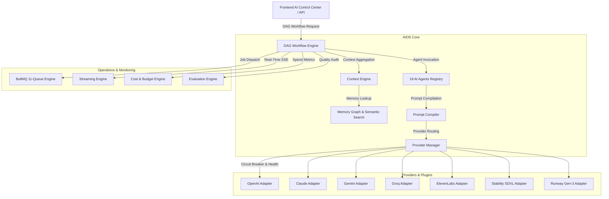

# StoryForge AI V3 — Phase 2: AI Operating System (AIOS) Master Guide

## 🚀 Overview

StoryForge AIOS is a modular, provider-agnostic, DAG-workflow-driven AI Operating System designed to orchestrate thousands of concurrent AI agents and multi-modal generation jobs across text, vision, audio, and video.

---

## 🏛️ AIOS Core Architecture



---

## 📦 Key Subsystems Summary

| Subsystem | Location | Primary Responsibility |
|-----------|----------|------------------------|
| **Provider Manager** | `src/aios/providers/` | Dynamic provider plugin registration, circuit breakers, latency tracking, weighted router, auto-failover. |
| **Agent Framework V2** | `src/aios/agents/` | 19 independent agents implementing standard 9 lifecycle methods (`execute`, `stream`, `validate`, `rollback`, etc.). |
| **Workflow Engine (DAG)** | `src/aios/workflow/` | Execution engine for Directed Acyclic Graphs (`DAGRunner`) with parallel nodes, dependencies, and execution logs. |
| **Memory Graph** | `src/aios/memory/` | Vector & relational memory store with semantic search over brand guidelines, tone, user feedback, and prompt history. |
| **Prompt Compiler** | `src/aios/prompts/` | 8-stage industrial prompt compiler with variable interpolation, safety rules, and provider formatting. |
| **Context Engine** | `src/aios/context/` | Aggregates project timeline, credits, memory, and optimizes token window limits. |
| **Queue Engine** | `src/aios/queues/` | BullMQ 11-queue engine with priority weighting, premium tiers, and DLQ relocation. |
| **Streaming Engine** | `src/aios/streaming/` | SSE and WebSocket event streaming for real-time tokens, logs, progress, and cost telemetry. |
| **Cost Engine** | `src/aios/cost/` | Real-time token/dollar spend tracking, user/org budget caps, and monthly forecasting. |
| **Evaluation Engine** | `src/aios/evaluation/` | Automated quality scoring (0-100) and auto-regeneration feedback loops. |
| **Plugin & Developer SDK** | `src/aios/plugins/` & `sdk/` | Framework for external developers to plug in custom Agents, Providers, and Prompt Packs. |

---

## 🛠️ Developer Integration Example

```typescript
import { sdk } from './src/aios/sdk/DeveloperSDK';
import { YOUTUBE_SHORTS_TEMPLATE } from './src/aios/workflow/WorkflowTemplates';

// Execute a YouTube Shorts DAG workflow programmatically
const resultGraph = await sdk.runWorkflow(YOUTUBE_SHORTS_TEMPLATE, {
  projectId: 'proj_123',
  userId: 'user_456',
  preferredProvider: 'claude',
});

console.log('Workflow status:', resultGraph.status);
```
