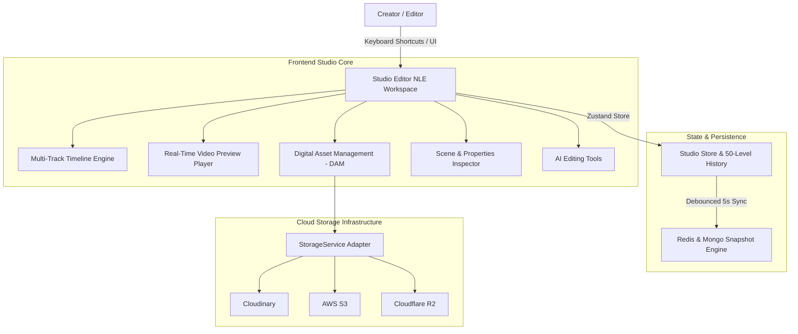

# StoryForge AI V3 — Phase 3: Professional Video Studio Master Guide

## 🎬 Overview

Phase 3 transforms StoryForge AI into a full-featured browser-based Non-Linear Video Editor (NLE) rivaling CapCut Desktop, Adobe Premiere Pro, and DaVinci Resolve.

---

## 🏛️ Studio System Architecture

---

## 📦 Key Subsystems Summary

| Module | Component Path | Responsibility |
|--------|----------------|----------------|
| **Timeline Engine** | `components/studio/timeline/` | Multi-track editing, frame-accurate playhead, snapping, keyframing, track lock/mute/solo, zoom scale. |
| **Preview Engine** | `components/studio/preview/` | Canvas player, WebAudio waveforms, timecode overlay, frame stepping, subtitle overlay, safe margins. |
| **Asset Library (DAM)** | `components/studio/assets/` | File categories, tagging, search, drag-and-drop upload, timeline insertion. |
| **Scene Inspector** | `components/studio/inspector/` | Scene properties, visual prompt tuning, camera pan/zoom/tilt, transitions, audio gain. |
| **AI Editing Tools** | `components/studio/ai-tools/` | One-click AI extend scene, shorten scene, B-Roll suggestions, silence removal, subtitle sync. |
| **Version Control** | `components/studio/versioning/` | Snapshot creation (`v1.0`, `v1.1`, `Auto-Save`), branch comparison, restore points. |
| **Storage Service** | `backend/src/services/StorageService.ts` | Multi-provider cloud storage abstraction (Cloudinary, S3, R2, Local). |
| **Command Palette** | `components/studio/search/` | Global search (`Cmd + K`) for scenes, assets, markers, prompts, and actions. |
| **Keyboard Shortcuts** | `components/studio/shortcuts/` | Listeners for Space, Cmd+Z, Cmd+S, Delete, S (Split), M (Marker), Arrow frame stepping. |
